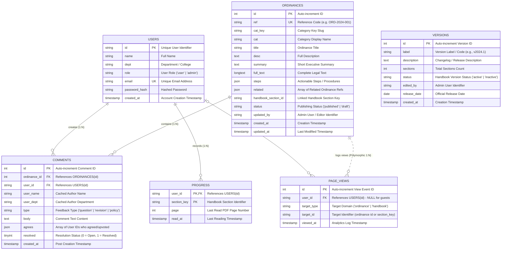

# Plawminary Database Entity Relationship Diagram (ERD)

This document provides a comprehensive Entity Relationship Diagram (ERD) and relational schema specification for the **Plawminary** database architecture (MySQL / SQLite).

---

## 📐 Entity Relationship Diagram

---

## 🗄️ Detailed Data Dictionary

### 1. `users`
Stores student and administrator user credentials, departmental affiliations, and access roles.

| Column | Type | Constraints | Description |
| :--- | :--- | :--- | :--- |
| `id` | `VARCHAR(64)` | `PRIMARY KEY` | Unique ID (e.g., student number or generated UUID). |
| `name` | `VARCHAR(255)` | `NOT NULL` | Full user name. |
| `dept` | `VARCHAR(255)` | `NOT NULL` | Department or College affiliation (e.g., "College of Computer Studies"). |
| `role` | `VARCHAR(32)` | `NOT NULL`, `DEFAULT 'user'` | Access role: `'user'` (Student) or `'admin'` (Administrator). |
| `email` | `VARCHAR(255)` | `NULL`, `UNIQUE` | Optional unique email address. |
| `password_hash` | `VARCHAR(255)` | `NOT NULL` | Bcrypted / hashed password string. |
| `created_at` | `TIMESTAMP` | `NOT NULL`, `DEFAULT CURRENT_TIMESTAMP` | Timestamp when user registered. |

---

### 2. `ordinances`
Contains official university policies and campus ordinances, complete with full text, steps, categories, and reference codes.

| Column | Type | Constraints | Description |
| :--- | :--- | :--- | :--- |
| `id` | `INT` | `PRIMARY KEY`, `AUTO_INCREMENT` | Internal numeric ordinance identifier. |
| `ref` | `VARCHAR(64)` | `NOT NULL`, `UNIQUE` | Human-readable reference code (e.g., `ORD-2024-001`). |
| `cat_key` | `VARCHAR(64)` | `NOT NULL` | Category key identifier (e.g., `student-conduct`). |
| `cat` | `VARCHAR(128)` | `NOT NULL` | Human-readable category label (e.g., "Student Conduct"). |
| `title` | `VARCHAR(512)` | `NOT NULL` | Title of the ordinance. |
| `desc` | `TEXT` | `NOT NULL` | Summary description of policy scope. |
| `summary` | `TEXT` | `NOT NULL` | High-level key summary. |
| `full_text` | `LONGTEXT` | `NOT NULL` | Complete text and clauses of the ordinance. |
| `steps` | `JSON` | `NULL` | JSON array of procedural steps/guidelines. |
| `related` | `JSON` | `NULL` | JSON array of related ordinance reference codes. |
| `handbook_section_id` | `VARCHAR(128)` | `NULL` | Logical link to associated handbook section key. |
| `status` | `VARCHAR(32)` | `NOT NULL`, `DEFAULT 'published'` | Status: `'published'` or `'draft'`. |
| `updated_by` | `VARCHAR(255)` | `NULL` | Name/ID of admin who last updated the record. |
| `created_at` | `TIMESTAMP` | `NOT NULL`, `DEFAULT CURRENT_TIMESTAMP` | Initial publishing timestamp. |
| `updated_at` | `TIMESTAMP` | `NOT NULL`, `DEFAULT CURRENT_TIMESTAMP ON UPDATE CURRENT_TIMESTAMP` | Automatic update timestamp. |

---

### 3. `comments`
Stores collaborative student discussions, questions, revision proposals, and upvotes on specific ordinances.

| Column | Type | Constraints | Description |
| :--- | :--- | :--- | :--- |
| `id` | `INT` | `PRIMARY KEY`, `AUTO_INCREMENT` | Unique comment identifier. |
| `ordinance_id` | `INT` | `NOT NULL`, `FK -> ordinances(id) ON DELETE CASCADE` | ID of the target ordinance being commented on. |
| `user_id` | `VARCHAR(64)` | `NOT NULL`, `FK -> users(id) ON DELETE CASCADE` | ID of the comment author. |
| `user_name` | `VARCHAR(255)` | `NOT NULL` | Denormalized user name at time of posting. |
| `user_dept` | `VARCHAR(255)` | `NOT NULL` | Denormalized user department at time of posting. |
| `type` | `VARCHAR(32)` | `NOT NULL`, `DEFAULT 'question'` | Comment type: `'question'`, `'revision'`, or `'policy'`. |
| `body` | `TEXT` | `NOT NULL` | Feedback message text. |
| `agrees` | `JSON` | `NULL` | JSON array containing user IDs of students who agreed/upvoted. |
| `resolved` | `TINYINT(1)` | `NOT NULL`, `DEFAULT 0` | 0 = Open thread, 1 = Resolved by administrator. |
| `created_at` | `TIMESTAMP` | `NOT NULL`, `DEFAULT CURRENT_TIMESTAMP` | Timestamp of comment submission. |

---

### 4. `progress`
Tracks student reading progress through sections of the digital Student Handbook.

| Column | Type | Constraints | Description |
| :--- | :--- | :--- | :--- |
| `user_id` | `VARCHAR(64)` | `NOT NULL`, `FK -> users(id) ON DELETE CASCADE` | ID of the student reader. |
| `section_key` | `VARCHAR(128)` | `NOT NULL` | Handbook section key identifier (e.g., `sec-1-1`). |
| `page` | `INT` | `NOT NULL` | Last read page index within the section. |
| `read_at` | `TIMESTAMP` | `NOT NULL`, `DEFAULT CURRENT_TIMESTAMP ON UPDATE CURRENT_TIMESTAMP` | Timestamp when progress was recorded. |

* **Composite Primary Key**: `(user_id, section_key)`

---

### 5. `page_views`
Stores audit and analytics events whenever a user or guest views an ordinance or handbook section.

| Column | Type | Constraints | Description |
| :--- | :--- | :--- | :--- |
| `id` | `INT` | `PRIMARY KEY`, `AUTO_INCREMENT` | Analytics event entry ID. |
| `user_id` | `VARCHAR(64)` | `NULL` | ID of authenticated user (`NULL` indicates guest user). |
| `target_type` | `VARCHAR(32)` | `NOT NULL` | Domain entity type: `'ordinance'` or `'handbook'`. |
| `target_id` | `VARCHAR(128)` | `NOT NULL` | Ordinance numeric ID or handbook section key string. |
| `viewed_at` | `TIMESTAMP` | `NOT NULL`, `DEFAULT CURRENT_TIMESTAMP` | Exact timestamp of view event. |

---

### 6. `versions`
Tracks student handbook version releases and revision history managed by administrators.

| Column | Type | Constraints | Description |
| :--- | :--- | :--- | :--- |
| `id` | `INT` | `PRIMARY KEY`, `AUTO_INCREMENT` | Version entry ID. |
| `label` | `VARCHAR(128)` | `NOT NULL` | Version code (e.g., `2024-2025 Revised Edition`). |
| `description` | `TEXT` | `NOT NULL` | Summary of changes or version changelog. |
| `sections` | `INT` | `NOT NULL`, `DEFAULT 0` | Total number of sections in this handbook version. |
| `status` | `VARCHAR(32)` | `NOT NULL`, `DEFAULT 'inactive'` | Status: `'active'` (current live version) or `'inactive'`. |
| `edited_by` | `VARCHAR(255)` | `NOT NULL` | Admin user who published or edited this version release. |
| `release_date` | `DATE` | `NOT NULL` | Effective release date of the handbook version. |
| `created_at` | `TIMESTAMP` | `NOT NULL`, `DEFAULT CURRENT_TIMESTAMP` | Log timestamp. |

---

## 🔗 Relationships Summary & Referential Integrity

1. **`users` ↔ `comments`** (1-to-Many):
   - A single `user` can write multiple `comments`.
   - `comments.user_id` references `users.id` with `ON DELETE CASCADE`.

2. **`ordinances` ↔ `comments`** (1-to-Many):
   - A single `ordinance` can have multiple discussion/feedback `comments`.
   - `comments.ordinance_id` references `ordinances.id` with `ON DELETE CASCADE`.

3. **`users` ↔ `progress`** (1-to-Many):
   - A `user` has progress records across multiple handbook sections (`section_key`).
   - `progress.user_id` references `users.id` with `ON DELETE CASCADE`.

4. **`users` ↔ `page_views`** (0..1-to-Many):
   - A logged-in `user` can produce multiple `page_views` events.
   - For guest views, `page_views.user_id` is set to `NULL`.

5. **`page_views` (Polymorphic Association)**:
   - When `target_type = 'ordinance'`, `target_id` links logically to `ordinances.id`.
   - When `target_type = 'handbook'`, `target_id` links logically to a `section_key` string in the handbook.

6. **`ordinances` ↔ Handbook Sections (Logical Link)**:
   - `ordinances.handbook_section_id` links ordinances to relevant handbook sections defined in application constants.

---

## ⚡ Key Indexes & Optimization Rules

| Index Name | Table | Columns | Purpose |
| :--- | :--- | :--- | :--- |
| `PRIMARY` | `users` | `id` | Quick lookup by user ID. |
| `idx_comments_ord` | `comments` | `ordinance_id` | Fast retrieval of comments for a given ordinance. |
| `idx_progress_user` | `progress` | `user_id` | Rapid aggregation of handbook completion rates per user. |
| `idx_pv_target` | `page_views` | `(target_type, target_id)` | Efficient analytics filtering by ordinance/section. |
| `idx_pv_user` | `page_views` | `user_id` | Quick user activity auditing. |
| `idx_pv_viewed` | `page_views` | `viewed_at` | High-performance date-range analytics queries. |
