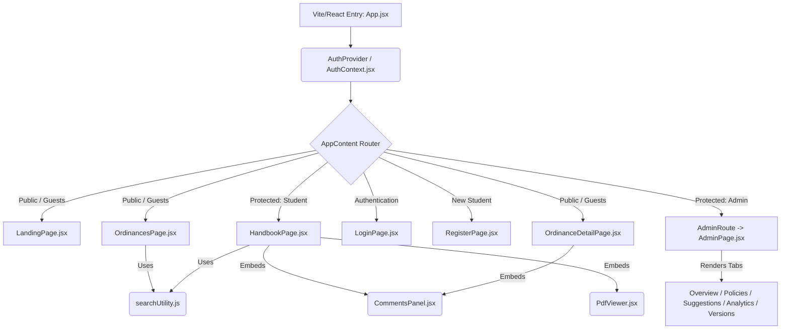

# Plawminary System Context & Architecture Guide

Welcome to the central system context and developer guide for **Plawminary**, the interactive student handbook and campus ordinances web application designed for **Pamantasan ng Lungsod ng San Pablo (PLSP)**.

This document serves as the high-level and detailed architecture overview of the current system, describing the module relationships, data flow, key utility modules, and core page structures.

---

## 🏛️ System Architecture Overview

Plawminary is built as a premium Single Page Application (SPA) using a state-of-the-art frontend stack and a dual Node.js/PHP backend architecture:
* **Core Frontend**: [React 19](file:///z:/Users/geana/Desktop/school%20shii/backups/LAWMINARY/package.json#L20) and [Vite 8](file:///z:/Users/geana/Desktop/school%20shii/backups/LAWMINARY/package.json#L38)
* **Styling**: [Tailwind CSS](file:///z:/Users/geana/Desktop/school%20shii/backups/LAWMINARY/package.json#L37) supplemented by custom inline HSL variables and CSS transitions for premium aesthetics.
* **Search Engine**: [Fuse.js](file:///z:/Users/geana/Desktop/school%20shii/backups/LAWMINARY/package.json#L18) powered by a customized synonym dictionary.
* **Document Engine**: [react-pdf](file:///z:/Users/geana/Desktop/school%20shii/backups/LAWMINARY/package.json#L22) to render and track the student handbook natively.
* **Backend Options**: Primary **Node.js (Express + mysql2)** REST API on port `3001` (with optional PHP 8+ PDO alternative).

---

## 🔑 Core State and Authentication Context

The global authentication state is managed within [AuthContext.jsx](file:///z:/Users/geana/Desktop/school%20shii/backups/LAWMINARY/src/context/AuthContext.jsx). It coordinates session state with the REST backend (`/api/auth/login`, `/api/auth/logout`, `/api/auth/register`):

1. **Role Access**:
   * **Verified Students**: Can access the interactive Student Handbook (`/handbook`), submit feedback comments, and agree with/upvote comments.
   * **Administrators**: Protected by [AdminRoute.jsx](file:///z:/Users/geana/Desktop/school%20shii/backups/LAWMINARY/src/components/AdminRoute.jsx) and redirected to the [AdminPage.jsx](file:///z:/Users/geana/Desktop/school%20shii/backups/LAWMINARY/src/pages/AdminPage.jsx) workspace.
   * **Guests**: Can browse public pages (`/`, `/ordinances`, `/ordinances/:id`), login (`/login`), or create an account (`/register`).
2. **Persistent Storage**: Utilizes `sessionStorage` (`'plawminary_user'`) to persist authenticated sessions across page reloads.

---

## 🔍 Semantic-Fuzzy Search Engine

A highlight of the Plawminary platform is its robust search implementation inside [searchUtility.js](file:///z:/Users/geana/Desktop/school%20shii/backups/LAWMINARY/src/utils/searchUtility.js). It introduces **Weighted Synonym Expansion** alongside classic fuzzy match weights to allow semantic-like behavior without requiring a vector database:

* **Weighted Properties**:
  * Title (1.0 weight)
  * Reference Code (0.9 weight)
  * Summary (0.8 weight)
  * Description (0.7 weight)
  * Full Ordinance Text (0.4 weight)
* **Synonym Expansion**: Custom synonym mapping automatically parses queries (e.g. searching "money" or "refund" matches "tuition fees" or "payment" sections).
* **Penalty Ranking**: Synonym matches receive a slight score penalty of `+0.15` to guarantee exact keyword matches are consistently ranked higher in UI searches.

---

## 📖 Smart Handbook Reader with Progress Tracker

The Student Handbook reader is integrated in [HandbookPage.jsx](file:///z:/Users/geana/Desktop/school%20shii/backups/LAWMINARY/src/pages/HandbookPage.jsx) and features an interactive PDF reader:

* **Synchronized Reading**: Uses [usePdfProgress](file:///z:/Users/geana/Desktop/school%20shii/backups/LAWMINARY/src/pages/HandbookPage.jsx) hook to track real-time progress per section.
* **Engagement Engine**: A section is automatically flagged as "Read/Completed" once the student remains on its corresponding page for at least **5 seconds**, promoting honest learning.
* **Interactive Navigation**: Clicking on chapters or individual sections (defined dynamically in [handbookSections.js](file:///z:/Users/geana/Desktop/school%20shii/backups/LAWMINARY/src/data/handbookSections.js)) signals [PdfViewer.jsx](file:///z:/Users/geana/Desktop/school%20shii/backups/LAWMINARY/src/components/PdfViewer.jsx) to scroll to the exact target PDF page.
* **Visual KPI Bar**: Features a sticky header showing progress percentage, pages read, and a visual progress bar.

---

## 💬 Collaborative Student Feedback Panel

Verified students can collaborate and engage with university policies via the [CommentsPanel.jsx](file:///z:/Users/geana/Desktop/school%20shii/backups/LAWMINARY/src/components/CommentsPanel.jsx) component.

* **Feedback Classification**: Comments are grouped and color-coded dynamically:
  * `revision` (✏️ For Revision)
  * `policy` (📝 Policy Suggestion)
  * `question` (❓ Question)
* **Engagement Indicators**: Displays college-specific avatars based on student majors and features a single-vote "Agree" (👍) mechanism stored in MySQL.

---

## ⚡ Server Architecture (Node.js Express & MySQL)

The primary dev backend runs on **Node.js with Express** and **MySQL** (`mysql2`), configured in [server/index.js](file:///z:/Users/geana/Desktop/school%20shii/backups/LAWMINARY/server/index.js) on port `3001`:

* **Entrypoint & Routing**: `server/index.js` boots Express, session middleware, CORS, and mounts API route modules:
  * `/api/auth`: Login, Logout, Registration, Me (`routes/auth.js`)
  * `/api/ordinances`: Ordinances search, filter, and management (`routes/ordinances.js`)
  * `/api/comments`: Ordinance feedback and upvotes (`routes/comments.js`)
  * `/api/progress`: Reading progress persistence (`routes/progress.js`)
  * `/api/admin`: Admin dashboard statistics and user moderation (`routes/admin.js`)
  * `/api/page-views`: Track page analytics (`routes/pageviews.js`)
* **Alternative PHP Server**: Legacy PHP 8.0+ PDO server is available via [index.php](file:///z:/Users/geana/Desktop/school%20shii/backups/LAWMINARY/server/index.php) (`npm run dev:server`).

---

## 🗂️ Critical Files Reference Map

| Domain | File Location | Purpose |
| :--- | :--- | :--- |
| **Routing / Setup** | [App.jsx](file:///z:/Users/geana/Desktop/school%20shii/backups/LAWMINARY/src/App.jsx) | Client-side routes (`/`, `/ordinances`, `/login`, `/register`, `/handbook`, `/admin`). |
| **Registration Page**| [RegisterPage.jsx](file:///z:/Users/geana/Desktop/school%20shii/backups/LAWMINARY/src/pages/RegisterPage.jsx) | Student account creation form interacting with `/api/auth/register`. |
| **Admin Workspace** | [AdminPage.jsx](file:///z:/Users/geana/Desktop/school%20shii/backups/LAWMINARY/src/pages/AdminPage.jsx) | Admin dashboard shell rendering tabs in `src/components/admin/`. |
| **State / Security** | [AuthContext.jsx](file:///z:/Users/geana/Desktop/school%20shii/backups/LAWMINARY/src/context/AuthContext.jsx) | User session state integrated with backend API routes. |
| **Logic / Helpers** | [searchUtility.js](file:///z:/Users/geana/Desktop/school%20shii/backups/LAWMINARY/src/utils/searchUtility.js) | Advanced Fuse.js semantic-fuzzy search logic. |
| **API Client** | [useApi.js](file:///z:/Users/geana/Desktop/school%20shii/backups/LAWMINARY/src/hooks/useApi.js) | Fetch wrapper handling API requests and credentials. |
| **Node.js Express API**| [server/index.js](file:///z:/Users/geana/Desktop/school%20shii/backups/LAWMINARY/server/index.js) | Express REST API server entrypoint. |
| **DB Initialization**| [schema.sql](file:///z:/Users/geana/Desktop/school%20shii/backups/LAWMINARY/server/db/schema.sql) / [seed.js](file:///z:/Users/geana/Desktop/school%20shii/backups/LAWMINARY/server/db/seed.js) | Database table schemas and seeding utilities. |
| **UI Components** | [CommentsPanel.jsx](file:///z:/Users/geana/Desktop/school%20shii/backups/LAWMINARY/src/components/CommentsPanel.jsx) | Student discussion and feedback portal. |
| **UI Components** | [PdfViewer.jsx](file:///z:/Users/geana/Desktop/school%20shii/backups/LAWMINARY/src/components/PdfViewer.jsx) | PDF display component for handbook reader. |

---

> [!TIP]
> **Suggested Workflows**:
> * To start development with Vite frontend and Node.js backend: `npm run dev`.
> * To seed the MySQL database: `npm run seed:node` (or `npm run seed` for PHP).
> * To run the PHP backend stand-alone: `npm run dev:server`.
